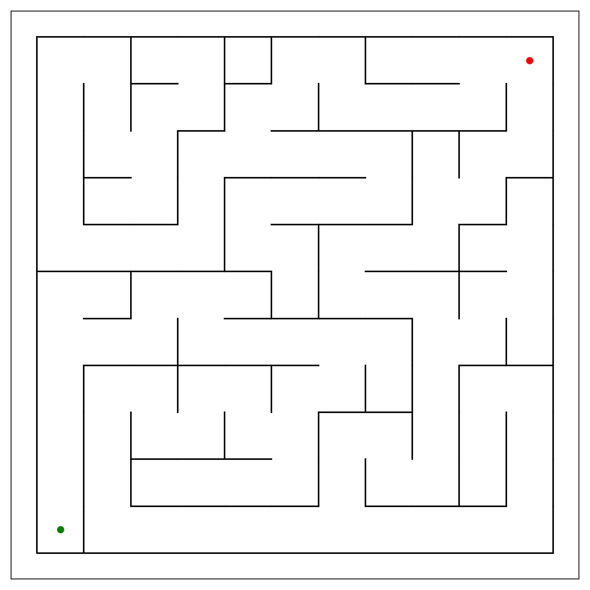
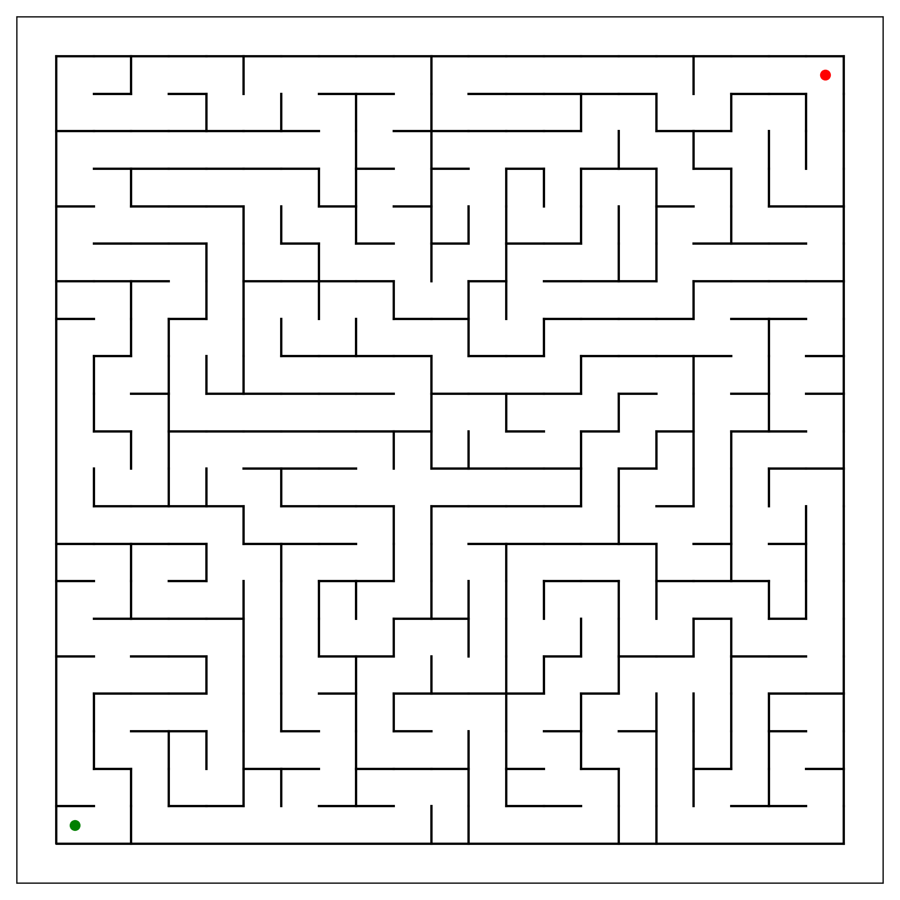
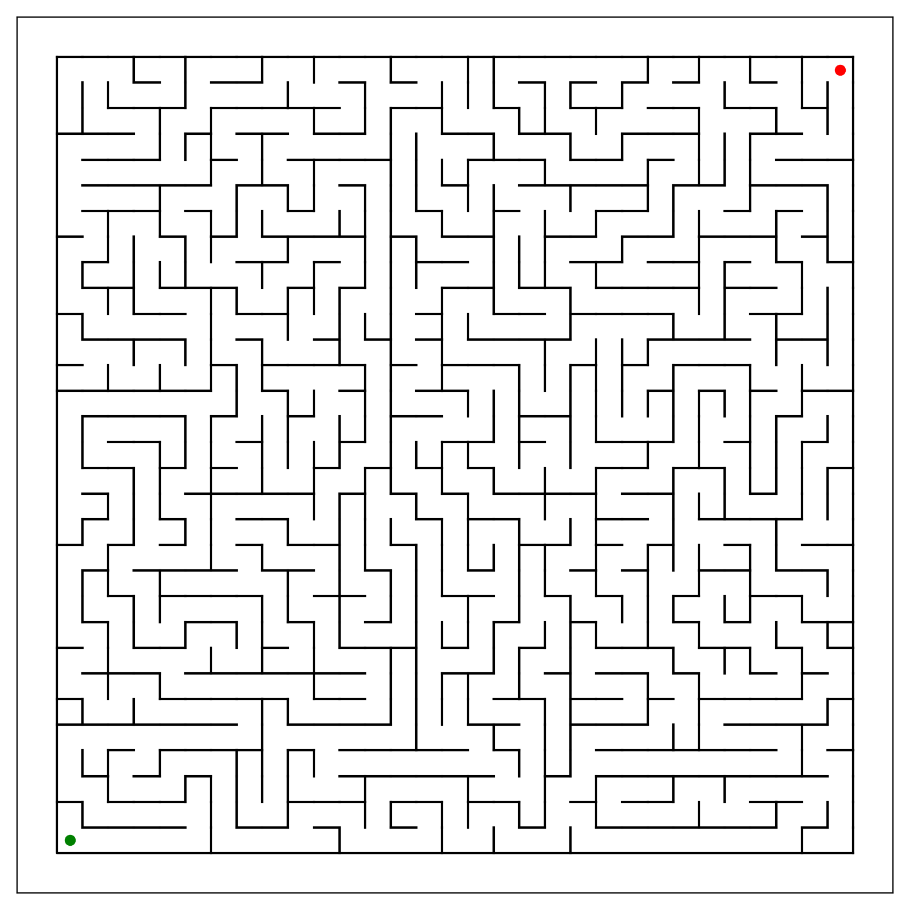

# Week 5, dagdeel 4
## Code Challenge
### The Maze
- Je kunt kiezen uit 3 doolhoven: 11×11, 21×21 of 31×31:

- De doolhoven zijn beschikbaar als binair bestand:
    - [maze_11x11.bin](maze_11x11.bin)
    - [maze_21x21.bin](maze_21x21.bin)
    - [maze_31x31.bin](maze_31x31.bin)
- Het programma [read_maze.c](read_maze.c) leest een doolhof in met de functie `readMaze()`. Geef de naam van het bestand op in regel 7.
- Het programma bevat de functie `printMaze()` die het doolhof uitprint met ASCII-tekens.
- Het programma bevat ook de functie `checkCell(int x, int y)`, die een `unsigned char` (byte) teruggeeft. Deze byte geeft aan welke uitgangen de cel met opgegeven coördinaten (*x*, *y*) heeft. De coördinaten lopen van linksonder (0, 0) tot bijvoorbeeld rechtsboven (10, 10) voor het 11×11-doolhof. Oost is de positieve *x*-richting en noord is de positieve *y*-richting. De byte bevat de som van de richtingen waarin je vanuit deze cel kunt bewegen:

    | richting | waarde |
    | --- | --- |
    | `NORTH` | 1 |
    | `EAST` | 2 |
    | `SOUTH` | 4 |
    | `WEST` | 8 |

    Dus als je vanuit een cel naar het noorden, het oosten en het westen kunt, geeft de functie de waarde 1 + 2 + 8 = 11 terug. Als de functie 0 teruggeeft, dan is er iets fout gegaan (verkeerde coördinaten). Als de functie de waarde 255 teruggeeft, heb je de finish bereikt.
- Je programma moet de route door het doolhof vinden van de start (groene stip) op (0, 0) naar de finish (rode stip) op bijvoorbeeld (10, 10) voor het 11×11-doolhof. Deze route moet geprint worden als een serie van de letters `N`, `E`, `S` en `W`.
- Denk na over een _algoritme_ om de route te vinden. Schrijf dit eerst op papier uit. Je kunt bijvoorbeeld telkens een stapje in één van de mogelijke richtingen zetten totdat je niet verder kunt. Dit weet je door te checken of een cel maar één mogelijke uitgang heeft: de richting waar je net vandaan kwam. In dat geval doe je een stapje terug en probeer je een ander pad.
- Om het algoritme te implementeren kun je *recursie* gebruiken. Je maakt dan bijvoorbeeld een functie die als argumenten meekrijgt:
    - de positie (_x_- en _y_-coördinaat)
    - de richting (`NORTH`, `EAST`, `SOUTH` of `WEST`) waarin een stapje is gezet om hier te komen.
    
    In de functie check je dan of je bij de finish bent of dat het pad doodloopt (als er maar één uitweg is). In dat laatste geval moet je een stapje terug door de functie te verlaten met `return`.

    In het geval dat er wel uitwegen zijn, probeer je die één voor één (behalve de richting waar je net vandaan kwam) door _dezelfde functie_ aan te roepen maar met de nieuwe positie en de richting van de stap. 
- Print iedere stap de richting die je genomen hebt (`N`, `E`, `S` of `W`). Als je een stapje terug moet kun je een geprinte letter wissen door het karakter *backspace* (`'\b'`) te printen.

**Optionele extra's**
- Print het doolhof met de gevonden route erin geplot.
- Maak een animatie van hoe de route stap voor stap gevonden wordt. Je kunt de functie `usleep()` gebruiken om een pauze in te lassen zodat het niet te snel gaat. Hiervoor moet je de regel  
`#include <unistd.h>`  
in je programma opnemen.
- Nieuwe doolhoven kun je genereren met dit [Python-programma](maze.py). Zet de gewenste afmetingen in regels 11 en 12. Hiervoor heb je Python nodig en het pakket MatPlotLib, dat je kunt installeren met  
`pip install matpliotlib`